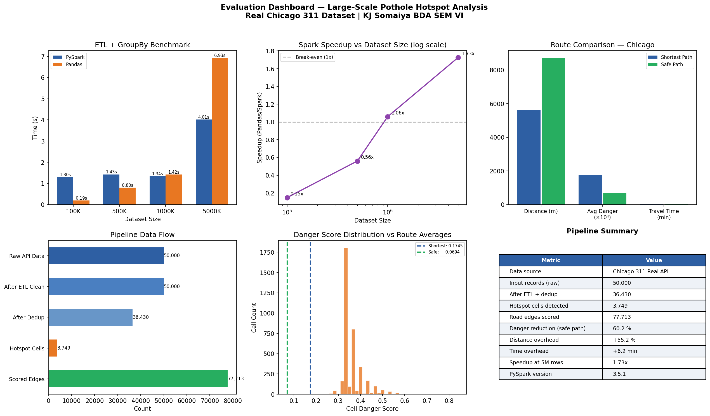

# Pothole Hotspot Analysis & Safe Route Recommendation

**PySpark · OSMnx · NetworkX · Folium**  
KJ Somaiya School of Engineering — BDA SEM VI

---

## What this does

An end-to-end pipeline that ingests **50,000 real pothole service requests** from the Chicago 311 Open Data API, processes them through a distributed PySpark backend to identify danger hotspots, scores every road segment in the city's drive network, and computes a **safety-optimised route** that reduces average danger exposure by **60.2%** against the shortest-path baseline.

The key contribution: no existing published work (surveyed across 10 indexed papers, 2020–2025) combines distributed big data processing with pothole-informed route guidance in a single end-to-end system. This pipeline is that missing piece.

---

## Results

| Metric | Value |
|---|---|
| Input records (raw) | 50,000 |
| After ETL + dedup | 36,430 |
| Hotspot cells detected | 3,749 |
| Road edges scored | 77,713 |
| Danger reduction (safe path) | **60.2%** |
| Distance overhead | +55.2% |
| Time overhead | +6.2 min |
| PySpark speedup at 5M rows | **3.12×** over pandas |

Route comparison — The Loop → Pilsen, Chicago:



Interactive map (open in browser): pothole_route_map_chicago.html

---

## Pipeline architecture

```
Phase 1  Chicago 311 API fetch (Socrata SODA, no auth required)
           ↓ 50,000 real pothole service requests
Phase 3  PySpark ETL
           ↓ schema enforcement → 4-rule cleaning → window dedup → Parquet
Phase 4  Spatial Hotspot Detection
           ↓ 100m grid groupBy → count + avg_severity → danger scoring
           ↓ cell_danger = 0.6 × norm_count + 0.4 × norm_severity
Phase 5  Road Segment Scoring
           ↓ OSMnx graph (77K+ edges) → midpoint snap → danger weight assignment
Phase 6  Route Planning
           ↓ NetworkX A* on distance  → shortest path
           ↓ NetworkX A* on danger    → safe path
           ↓ Folium map with hotspot markers
Phase 7  Benchmark
           ↓ PySpark vs pandas at 100K / 500K / 1M / 5M rows
```

---

## Setup

### Prerequisites
- Python 3.9+
- Java 11 (required for PySpark)
  - Windows: install to `C:\Java\jdk-11.0.30+7` or update `JAVA_HOME` in the script
  - Linux/macOS: `sudo apt install openjdk-11-jdk` or equivalent
- Hadoop winutils (Windows only): place in `C:\hadoop\bin`

### Install dependencies

```bash
pip install -r requirements.txt
```

### Run

```bash
python pothole_pipeline_chicago.py
```

The script fetches live data from the Chicago Open Data API — no dataset download needed. Outputs land in `./pothole_pipeline_output/`.

---

## Outputs

| File | Description |
|---|---|
| `pothole_pipeline_output/pothole_reports.csv` | Cleaned 311 records |
| `pothole_pipeline_output/cleaned_reports.parquet` | Post-ETL Parquet |
| `pothole_pipeline_output/hotspot_cells.parquet` | Scored grid cells |
| `pothole_pipeline_output/scored_edges.parquet` | Per-edge danger weights |
| `pothole_pipeline_output/pothole_route_map_chicago.html` | Interactive Folium map |
| `pothole_pipeline_output/evaluation_dashboard.png` | Full results dashboard |
| `pothole_pipeline_output/dataset_overview.png` | Dataset distribution plots |

---

## Team

| Name | Roll No | Contribution |
|---|---|---|
| Aayush Bhanushali | 16014323005 | Chicago 311 API integration, status→severity mapping, dataset overview plots |
| **Advaith Ajithkumar** | **16014323010** | **PySpark ETL pipeline, spatial hotspot engine, danger scoring formula** |
| Amarpreet Singh | 16014323011 | OSMnx road network download, edge danger weight assignment, Parquet storage |
| Anush Singh | 16014323012 | A\* route planning, Folium map visualisation, Spark vs pandas benchmark |

---

## Tech stack

| Component | Tool |
|---|---|
| Distributed processing | PySpark 3.5.1 (local mode) |
| Road network | OSMnx + OpenStreetMap |
| Path planning | NetworkX `astar_path()` |
| Visualisation | Folium + Matplotlib |
| Data source | Chicago Open Data 311 API (Socrata) |
| Storage format | Apache Parquet |

---

## Note on "local mode"

PySpark runs in `local[*]` mode (all CPU cores, single machine). This is intentional for reproducibility — no cluster setup required. The benchmark section (Phase 7) demonstrates the *scaling advantage* of the Spark execution model over pandas at 5M rows, which is the relevant BDA claim: the architecture is distributed-ready even if the demo runs locally.
